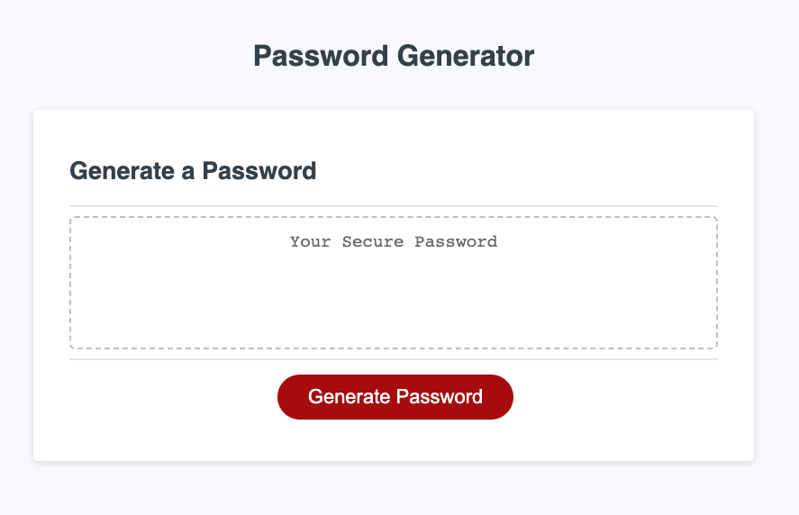
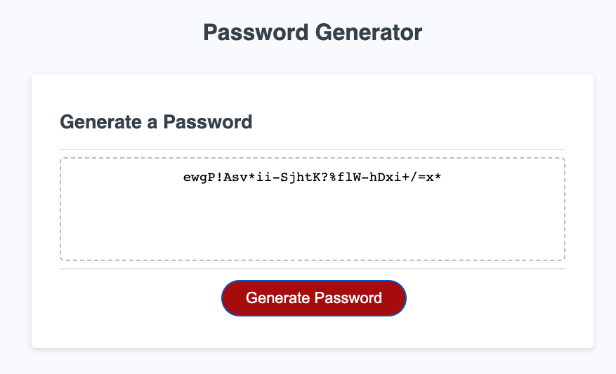

# Password-Generator

## What Is It?

This nifty little website can generate a truly random string between 8 and 128 characters long, creating passwords that can stand up to brute force attacks for hundreds of years.

## Where Is It?

You can view (and use) the generator at [https://corynko.github.io/Password-Generator](https://corynko.github.io/Password-Generator)

## How Do I Use It?

Click the "Generate Password" button, and answer the prompts. Your new password will appear in the box.

## Who Can Use It?

This generator is open source and based on starter code by @friendly-parakeet. Anyone can use it, but please note that no actual cybersecurity experts have verified the claims made in this README.
